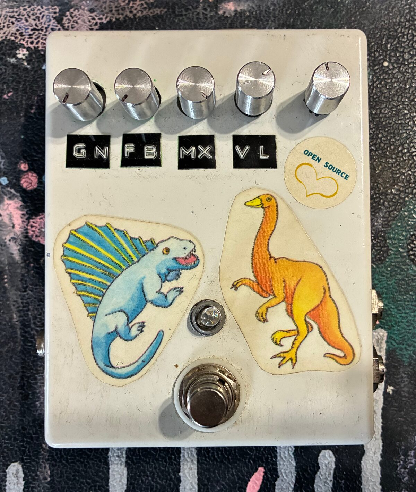

# stomp_arp

An Arduino sketch for the [OpenMusicLabs StompShield](http://www.openmusiclabs.com/projects/stomp-shield/) that creates a rhythmic octave-up "arpeggio" effect by alternating between normal-speed and double-speed playback of a short live audio buffer. The rotary encoder on the pedal sets the alternation rate.

## Hardware

- Arduino (Uno / 328-based)
- OpenMusicLabs StompShield
- Rotary encoder wired to the shield (A → D2, B → D4, button → D7)

## Origin

This sketch started as `stomp_updown.pde`, one of the example sketches that ships with the StompShield (OpenMusicLabs, 7.15.13). The original demonstrated buffered playback by sweeping a read pointer through a 1000-sample ring buffer — forward at double speed, then backward at single speed, bouncing at the buffer boundaries. The rotary encoder was wired up by the shield but not used by the sketch.

## What changed

Instead of bouncing the read pointer back and forth, this version keeps it moving forward and **toggles its step size** between 1 (normal pitch) and 2 (octave up) at a regular interval. The result is a two-note stutter — the input signal plays at its original pitch, then jumps an octave, then drops back, repeating. With a guitar going in, it sounds like a very tight octave-up arpeggio.

Specifically:

- **Bounce → alternation.** The original `dir` / `offset` bounce logic was replaced with a single forward-advancing `playLocation` whose increment is either `+1` or `+2` depending on a `doubleSpeed` flag.
- **Mode flip in the ISR.** An `intervalCount` counter inside the `TIMER1_OVF_vect` ISR flips `doubleSpeed` every `INTERVAL` audio samples (the ISR runs at ~48 kHz, so 48 ticks ≈ 1 ms).
- **Rotary encoder is now live.** A small `pollEncoder()` routine runs from `loop()` (polled ~1 kHz) and remaps the encoder's position to `INTERVAL`, giving a usable range from ~2 ms (fast warble) up to ~100 ms (slow, audible octave stutter).
- **Encoder button (D7) is wired but unused.** Reserved for a future on/off bypass or rate reset.

## Files

- `stomp_arp.ino` — the sketch
- `sketch.properties` — Arduino IDE metadata

## Building

Requires the OpenMusicLabs `StompShield` library on your include path. Open the folder in the Arduino IDE and upload to the board.
